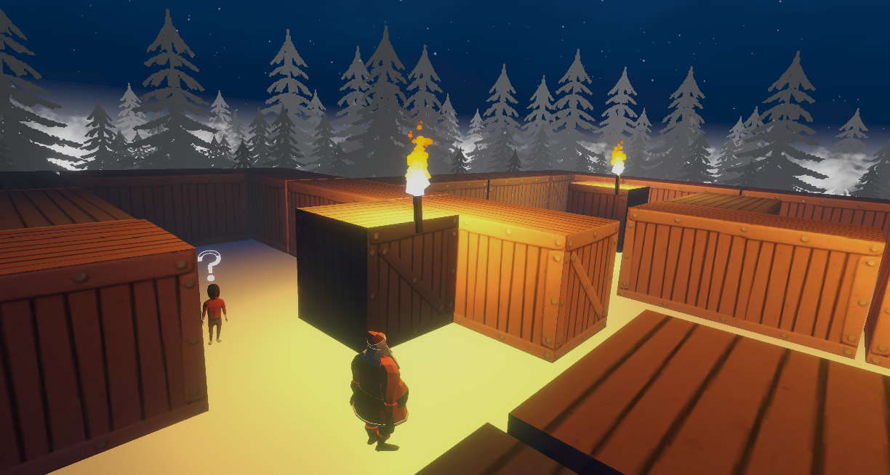
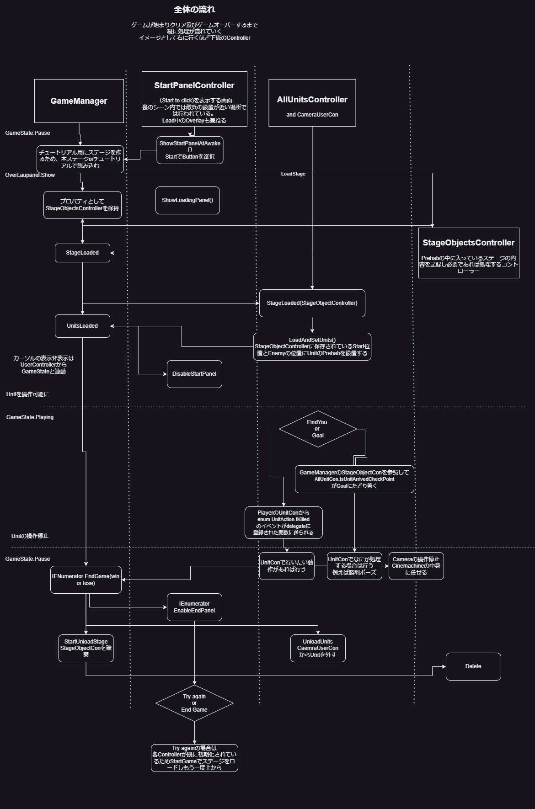
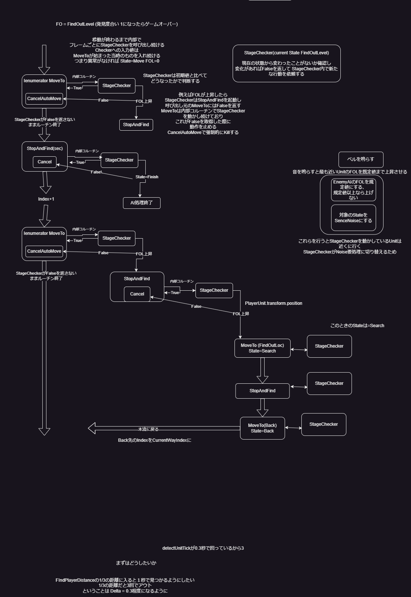

# 我らサンタクロース一等兵
使用技術
----

全体図
----
動作環境はWindows   
ステルスゲームかつ3DでTPSのパズルゲームを組み合わせた形のゲーム   
参考にするゲームはPortalとMetalGearSolit   
攻撃を行わない誘導だけでステルスをしつつゴールに辿り着くという形   
発見されたら即ゲームオーバー   
ステージは選択型でLevelの低いステージをクリアすると次が開放される   
外観としてはローポリでライティングはリッチに行う形   
とりあえずサンタクロースモチーフだが時期がすぎるため、エイリアンなどの季節に関係ないものに置き換え予定   

必要機能
----
ゲームスタート画面   
ステージセレクト画面もゲームスタート画面に共になっている、つまりゲーム内でステージセレクト画面はない
Portalのステージセレクト等を参考に      
SceneはMainSceneのみでここにPrefabの形でステージを用意する   
Scene遷移は重くなりがちで、Prefabを読み込む型ならaddressableで非同期読み込みによりスタート地点から優先的に読み込むなどの工夫が可能   
兵士の行動としてルーチンを周る -> 異常があれば発見者が異常発見地点に向かう -> 異常発見できなければ通常行動  
画面となるSceneは１つで大まかに 

技術
----
レンダーパイプラインは使い慣れているURPで   
Animationを丁寧に作る事でリッチ感が出る   
LightingはBakerlyを使用   
開発環境はUnity   

目標
----
制作期間は2024年12月から開始して約半年となる   
ノートPCでも十分に動く程度の軽量ゲーム   
最終的にはSteamでの公開を目指す   

ルール
----
発見状態にならずにゴールまでたどり着けたら勝ち   
敵に発見されたら負け   
wsdaによる3Dの移動と +Shiftによるダッシュが可能  
マウス右クリックでベルを鳴らすことができ、直線距離が最も近い敵一人が確認しに来る   
(前方にいる直線距離で最も近い敵一人に変更予定)   

テストプレイ
---
※ v1.0.3-alpha   

ゲーム全体のフロー
----
※GameManagerで全体のフローを管理する古いバージョンのもの   
**ゲーム全体の流れ**   

   
**敵AIルーチン**   

TODO   
---
- 当初開発速度を要求されたためゲームにおける各Controller間の実行をシングルトンなGameManager上に実装   
下記で実装するKeyboardによるUI操作等もGameManagerに一任するとGameManagerが肥大化するため、GameStream classを実装する
- ステージセレクトに対応できていない(StartPanelにOSAを利用したListを作成)
- ゲーム中のescによる一時停止及びrestart, return to start panelの実装   
内部ではdebug用にPlayer及びEnemyの一時停止は実装済み   
またpostprocessingのGaussianBlurも実装済み   
残りはPausePanelのみとなる   
- ゲームの設定UIの実装   
現在はベタでコードに書いている内容をUIで変更可能なUIの実装   
- 敵に後ろから接触した際の強制発見   
Unit同士のlayerはぶつからない仕様にして、ぶつかった際にアニメーション再生と後ろへの回転を行う
- 壁に張り付くモーションと移動   
- Messageなどの条件に応じて表示するものを今は表示数も少なく開発速度を上げるため、各コンポーネントのインスペクタに書いているが   
これを以前作ったNode形式のイベント管理システム EventNodesに置き換える   

アセットなどの注意点
----
BakeryのPointLightをPointLightComponentと同居させると実行時にrealtime lightが反映されなくなる   
多分バグ？   

----

©2024 Daiki Ito